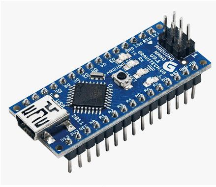
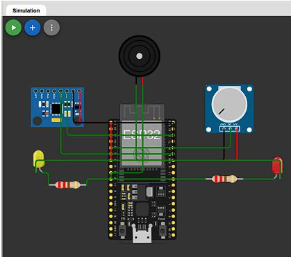

# 🪖 Smart Helmet for Safety Applications

**Real-time alcohol & drowsiness detection system for motorcycle riders**, built on an Arduino Nano with an MQ-3 alcohol sensor and MPU6050 IMU. Detects rider impairment and warns both the rider (buzzer) and surrounding traffic (external LEDs).

[](https://ananyanair12.github.io/smart-helmet-safety-system/simulation/)
[](firmware/smart_helmet.ino)
[](LICENSE)

> Built as part of **EPICS346 — An Engineering Project in Community Service**, VIT Bhopal University (Phase II, April 2025). Full academic report in [`docs/`](docs/).

---

## ▶️ Try it — live simulator

No hardware needed. The [interactive simulator](https://ananyanair12.github.io/smart-helmet-safety-system/simulation/) is a browser-based digital twin of the firmware: drag the sliders to simulate the alcohol sensor and head-tilt readings, and watch the exact same threshold/filtering/alert-priority logic that runs on the real Arduino fire in real time.

<p align="center">
  
</p>

## The problem

Motorcycles are the dominant mode of transport across much of Asia, and riders are disproportionately represented in road fatalities. Two preventable factors — **drowsiness** and **alcohol impairment** — are consistently among the leading causes. A conventional helmet protects *during* a crash; it does nothing to prevent one caused by an impaired rider. This project asks: what if the helmet could tell?

## How it works

The helmet runs two detection modules in parallel on an Arduino Nano:

| Module | Sensor | Signal | Threshold |
|---|---|---|---|
| **Alcohol detection** | MQ-3 gas sensor | Breath alcohol → analog voltage → estimated BAC% | BAC ≥ 0.08% |
| **Drowsiness detection** | MPU6050 gyro/accelerometer | Head pitch/roll from complementary-filtered IMU data | Sustained forward nod or side-drop for ≥ 1.5s |

When impairment is detected, the alert manager drives:
- **Internal alert:** buzzer (continuous for alcohol, intermittent for drowsiness — alcohol always takes priority if both fire at once)
- **External alert:** red LED (alcohol) / yellow LED (drowsiness), mounted on the back of the helmet, visible to traffic up to ~10m away

Both detection algorithms apply temporal filtering (moving averages, sustained-duration checks) specifically to suppress false positives — a known weak point in prior smart-helmet research (see [`docs/`](docs/) literature review).

<p align="center">
  
</p>

## Repository structure

```
smart-helmet-safety-system/
├── firmware/
│   └── smart_helmet.ino        # Full Arduino sketch — detection + alert logic
├── simulation/
│   └── index.html              # Browser-based prototype (no hardware required)
├── hardware/
│   └── components.md           # Bill of materials, pinout, wiring notes
├── docs/
│   ├── images/                 # Block diagram, circuit simulation
│   └── Phase2_Report.pdf       # Full academic project report
├── LICENSE
└── README.md
```

## Hardware

| Component | Role |
|---|---|
| Arduino Nano | Central processing / decision engine |
| MQ-3 alcohol sensor | Breath alcohol concentration (analog, A0) |
| MPU6050 | 3-axis gyro + accelerometer for head-tilt tracking (I2C) |
| Buzzer (85dB) | Internal rider alert |
| Red / Yellow LEDs | External alert to surrounding traffic |
| 3.7V Li-ion battery (2000mAh) | ~25.6h operation under normal monitoring |

Full pinout and wiring in [`hardware/components.md`](hardware/components.md).

## Results (from prototype testing)

- **Alcohol detection:** 92.4% detection rate at BAC 0.08–0.10%, 98.7% at BAC > 0.10%
- **Drowsiness detection:** 93.7% detection rate for combined head-movement patterns, 1.6–2.2s response time
- **External LED visibility:** 84–94% detection by surrounding traffic at 5–10m
- **Battery life:** ~25.6 hours under normal monitoring, ~11.9 hours with all alerts continuously active

Full methodology, test tables, and discussion are in the [project report](docs/).

## My contribution

I led **system testing methodology and data analysis**: designed the controlled experiments for alcohol and drowsiness detection testing, built the data collection/statistical evaluation framework used across all result tables, ran the power-consumption measurements that informed battery selection, and synthesized the final performance evaluation.

## Running the firmware

1. Wire components per [`hardware/components.md`](hardware/components.md)
2. Install the `MPU6050` and `Wire` libraries in the Arduino IDE
3. Flash [`firmware/smart_helmet.ino`](firmware/smart_helmet.ino) to the Nano
4. Open Serial Monitor at 9600 baud to view live BAC%, pitch, and roll readings

## License

MIT — see [LICENSE](LICENSE).
